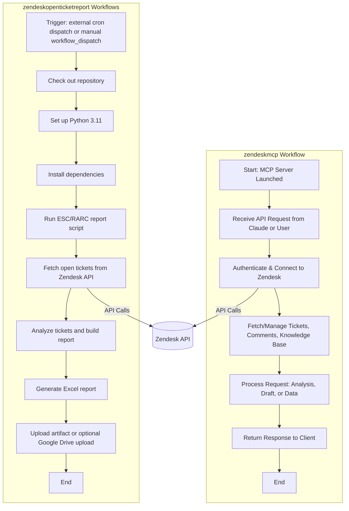

# Zendesk Integration Workflow Diagram

This diagram illustrates how the `zendeskopenticketreport` and `zendeskmcp` workflows operate and interact with Zendesk data and other services.

---

---

**Legend:**
- Both workflows interact with Zendesk via API calls.
- `zendeskopenticketreport` uses a GitHub Actions workflow: `zendeskreport_esc-rarc.yml`, which is triggered via `workflow_dispatch` and may be externally dispatched on a schedule.
- `zendeskmcp` runs as a server, providing API endpoints for ticket management, analysis, and integration with tools like Claude.

