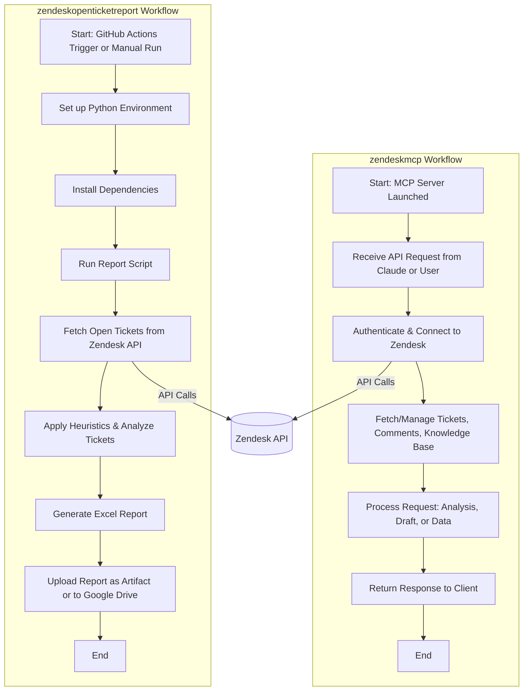

# Zendesk Integration Workflow Diagram

This diagram illustrates how the `zendeskopenticketreport` and `zendeskmcp` workflows operate and interact with Zendesk data and other services.

---

---

**Legend:**
- Both workflows interact with Zendesk via API calls.
- `zendeskopenticketreport` is focused on automated reporting and ticket analysis, triggered by GitHub Actions or manually.
- `zendeskmcp` runs as a server, providing API endpoints for ticket management, analysis, and integration with tools like Claude.

